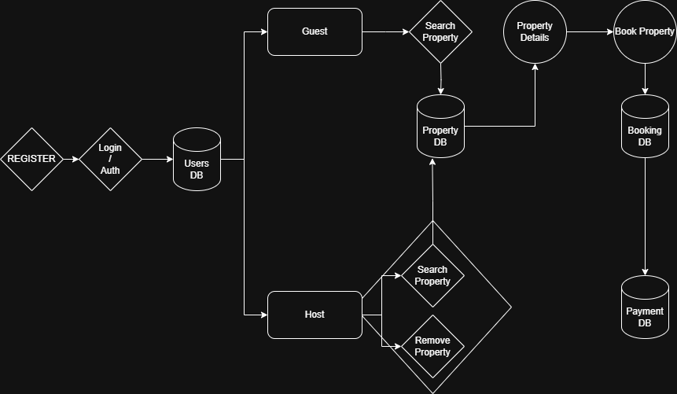

# Data Flow Diagram – Airbnb Clone Backend

This DFD visualizes how data flows between external actors (guests, hosts), system processes, and the underlying data stores such as Users, Properties, Bookings, and Payments.

