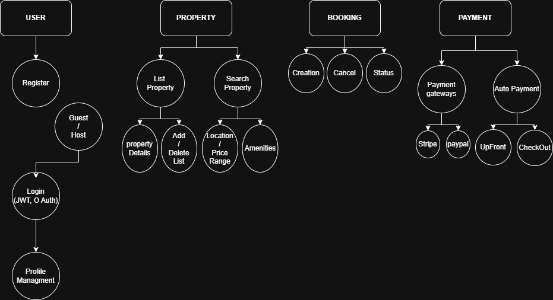

# Airbnb Clone Backend - Features & Functionalities

## Airbnb Clone Backend Features
```
 └── 1. User Management
    ├── Register (Guest / Host)
    ├── Login (JWT, OAuth)
    ├── Profile Management
└── 2. Property Listings
    ├── Add Listing
    ├── Edit/Delete Listing
    └── Listing Details (Title, Price, Location, Amenities)
└── 3. Search & Filter
    ├── Location
    ├── Price Range
    ├── Amenities
    └── Pagination
└── 4. Booking Management
    ├── Create Booking
    ├── Cancel Booking
    ├── Booking Status (Pending, Confirmed, Cancelled)
└── 5. Payments
    ├── Stripe/PayPal Integration
    ├── Guest Payment
    └── Host Payout
└── 6. Reviews & Ratings
    ├── Submit Review
    └── Host Response
└── 7. Notifications
    ├── Email Notifications
    └── In-App Alerts
└── 8. Admin Dashboard
    ├── Manage Users
    ├── Manage Listings
    ├── Manage Bookings
    └── Manage Payments 
```


## Diagram
This diagram illustrates the core backend features required for the Airbnb Clone project. It includes user authentication, property listings management, booking and payment systems, and more.


