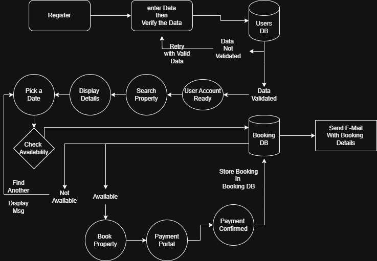

# Flowchart – Property Booking

This flowchart illustrates the step-by-step logic of the property booking process in the Airbnb Clone backend. It includes searching for a property, checking availability, making payment, and confirming booking.

