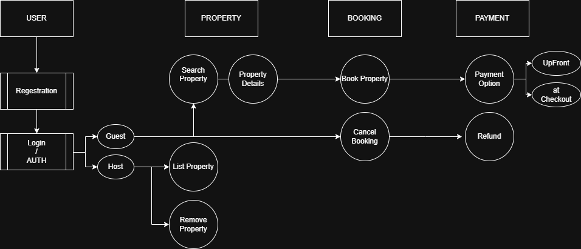

# Use Case Diagram – Airbnb Clone Backend

This diagram shows how different user roles (Guest, Host) interact with the backend system for core features such as registration, booking, payments, and management.

